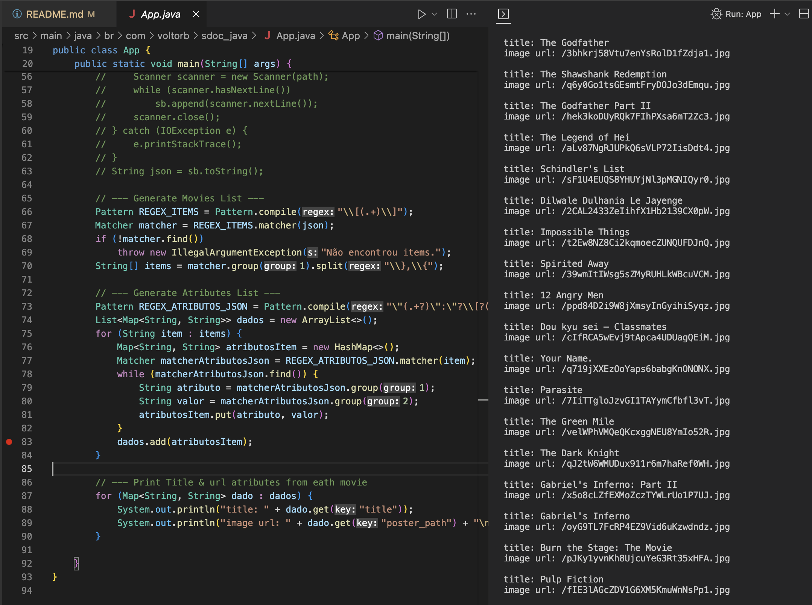
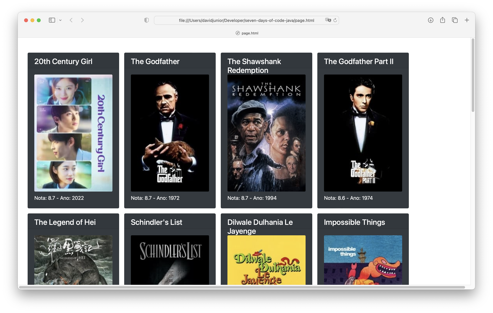

# 7 Days Of Code - Java

## Resumo do projeto:
Usando apenas código Java, consumir uma API para pesquisar os top 250 filmes da lista do ~~IMDB~~ TMDB e criar um HTML com os resultados JSON devolvidos.

## Stack:
- `Linguagem Java`
- `JSON`
- `TMDB API`

# Dia 1:
- [X] Criar uma conta no ~~IMDB~~ TMDB para ter a chave de acesso ao serviço (apiKey).
- [X] Criar o código Java que executará uma requisição HTTP do tipo GET.
- [X] Executar a requisição e pegar a resposta (o JSON)
- [X] Imprimir o corpo da resposta no console

Utilizando apenas as bibliotecas do pacote `java.net.http` foi feita a requisição a API do TMDB e recuperado o JSON da lista dos melhores filmes:

# Dia 2:
- [x] Extrair o título do filme e a URL da imagem a partir da resposta JSON utilizando apenas as bibliotecas da JRE e Regular Expressions.
- [x] Imprimir esses atributos no console.

# Dia 3:
- [x] Iniciar uma modelagem melhor do código através de uma classe Movie.
- [X] A classe Movie terá os atributos: titulo, url de imagem, nota e ano de lançamento.

Para encapsular os dados de cada filme foi criada uma classe do tipo Record.

# Dia 4:
- [X] Gerar uma página HTML a partir da lista de objetos (filmes) existentes, onde será possível ver as informações sobre o filme, incluindo o pôster.

Foi criada a classe HTMLGenerator que recebe no construtor um objeto Writer e um método chamado generate que recebe a lista de filmes e através do Writer gera o arquivo HTML com os dados de todos os filmes.

