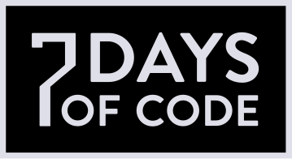
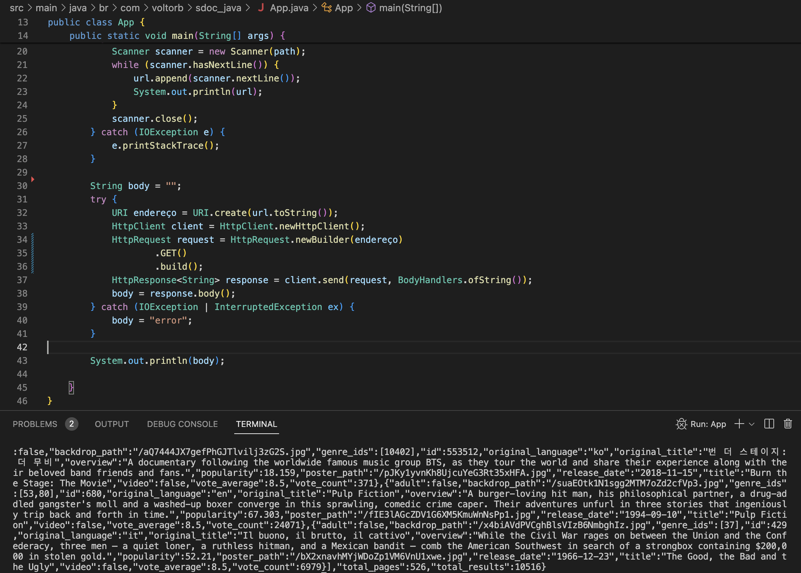

# 7 Days Of Code - Java

## Resumo do projeto:
Usando apenas código Java, consumir uma API para pesquisar os top 250 filmes da lista do IMDB e criar um HTML com os resultados JSON devolvidos.

## Stack:
- `Linguagem Java`
- `Maven`

# Dia 1:
- [X] Criar uma conta no IMDB para ter a chave de acesso ao serviço (apiKey).
- [X] Criar o código Java que executará uma requisição HTTP do tipo GET.
- [X] Executar a requisição e pegar a resposta (o JSON)
- [X] Imprimir o corpo da resposta no console

